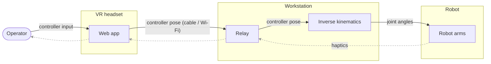

# vr-teleop-kit

A kit for teleoperating robot manipulators with a WebXR headset
(Meta Quest). A web page served from your workstation runs in the Quest
browser, streams 6-DoF controller poses over a WebSocket, and a Python
teleoperator turns them into joint commands via differential inverse
kinematics (forward kinematics and Jacobians read from a MuJoCo model
of the arm, built from its URDF). Plugs into [LeRobot](https://github.com/huggingface/lerobot)
as a drop-in `Teleoperator`.

> **Full write-up:** [**VR Teleoperation Stack for Robot Manipulation**](https://aurelarnold.xyz/blog/vr-teleoperation-stack/) walks through the whole stack: the inverse kinematics, the safety features, and the camera and haptic feedback that close the loop.

Robots supported end-to-end:

- [TRLC-DK1](https://www.robot-learning.co) bimanual arm (6-DoF × 2)
- [SO-101 / SO-ARM101](https://github.com/TheRobotStudio/SO-ARM100)
  single arm (5-DoF; see "SO-101" below)

The pose mapping and the relay are robot-agnostic; supporting another
arm means porting the IK layer (see "Adapting to a different arm"
below).

Highlights:

- **Clutch-relative mapping**: hold the grip button and the robot follows
  your hand's relative motion; release, reposition, grab again.
- **Controller buttons**: grip = clutch; a precision modifier (hold to
  lower the gains for fine work); and a button that sends the arm back to
  its home pose.
- **Reach limit**: the target pose can never run more than a fixed
  distance or angle ahead of the robot. Pressing past a joint limit or the
  workspace boundary feels like a wall (with haptic feedback), and
  reversing bites immediately, like a mouse cursor at the edge of the
  screen.
- **Decoupled IK**: joints 1-3 track position, the
  wrist tracks orientation, both as damped-least-squares steps with
  manipulability-adaptive damping (graceful near singularities and
  gimbal lock).
- **Wrist-pivot calibration**: a 5-second in-VR ritual aligns the
  controller read-out point with your anatomical wrist pivot, so pure
  wrist twists don't drag the arm around.
- **Haptics**: gripper grasp force and IK trouble (joint limits, reach,
  gimbal proximity) are mapped to controller vibration.
- **Camera streaming**: optional WebRTC streams of robot cameras,
  rendered as world-locked panels inside VR.
- **Two ways to connect**: USB cable (`adb reverse`, ~1 ms latency,
  recommended) or Wi-Fi (LAN HTTPS with a self-signed certificate). A
  public tunnel works for pose streaming too, but the WebRTC camera media
  is not configured off-LAN (it needs a TURN server), so full remote
  operation isn't set up.
- Live-tunable settings (gains, smoothing, velocity caps, haptic
  thresholds) from the web page, applied on the next solver tick.
- **Data and training in the browser**: a second page (`/data`) records
  demonstrations, plays each episode back beside its joint traces so the
  failures can be marked and pruned, then launches and plots policy
  training — and runs a trained checkpoint back on the arm.

## Architecture

Three layers, separated by how robot-specific they are:

```
src/vr_teleop_kit/
├── core/      robot-agnostic: clutch-relative pose mapping + reach limit
├── relay/     robot-agnostic: FastAPI WebSocket relay, WebRTC cameras,
│              and the web pages served to the Quest and the desktop
├── data/      robot-agnostic: dataset review + job orchestration behind
│              the /data page (episode grading, keep/reject marks, and
│              detached runners for recording, training and rollout)
├── ik/        DK1-tuned: decoupled IK (MuJoCo model
│              built from the DK1 URDF, wrist-anchor geometry, mount frames)
└── lerobot/   thin adapter: LeRobot Teleoperator classes wiring core+ik
               into the LeRobot action interface
```

`data/` keeps its heavy imports at arm's length: the modules the relay
loads read parquet and JSON only, and every runner that needs `lerobot`
or `torch` runs in its own subprocess. The relay is the teleop latency
path and does not pay for them.



For pose and state messages the relay is a pure broadcast hub: any number
of clients (teleop processes, MuJoCo viewers) can subscribe to the same
stream. (It also publishes the optional WebRTC camera tracks, and serves
the `/data` review-and-training page described below.)

## Install

Everything below is shared by both arms. The robot-specific steps follow:
**on an SO-101, continue at [SO-101 (SO-ARM101)](#so-101-so-arm101)**,
which carries install, calibration, testing and running end to end; the
DK1 driver is at the bottom of this section.

### 1. Python environment

Developed and verified on **Python 3.12.3, Linux x86_64**. The package
declares `requires-python = ">=3.10"`, but 3.12 is what every path here
has actually been run against.

```bash
git clone https://github.com/oscardvs/vr-teleop-kit
cd vr-teleop-kit

uv venv --python 3.12          # or: python3.12 -m venv .venv
source .venv/bin/activate
```

### 2. Install the package

Two ways, depending on whether you want a fresh resolve or the exact
environment this was built in.

**Portable** — resolves against the constraints in `pyproject.toml`.
This is what you want unless you are reproducing recorded data:

```bash
uv pip install -e ".[relay,so101-data,dataui]"   # SO-101: teleop + record + train
uv pip install -e ".[relay,so101]"               # SO-101: teleop only
uv pip install -e ".[relay,lerobot]"             # DK1
```

(Drop `uv` for plain `pip` — the commands are otherwise identical.)

**Exact** — the environment the datasets were recorded with and the
checkpoints trained in, down to the patch version:

```bash
uv pip install -r requirements.lock.txt
uv pip install -e . --no-deps
```

`requirements.lock.txt` pins a CUDA 13.0 / Linux x86_64 build of torch
(`2.11.0+cu130`, RTX 4080 SUPER). On different CUDA or a CPU-only box
those `nvidia-*` pins will not install — use the portable path instead
and let torch resolve for your platform. Regenerate the lock with:

```bash
uv pip freeze --python .venv/bin/python | grep -v '^-e ' > requirements.lock.txt
```

`lerobot` is pinned to **0.6.1** in every extra that pulls it. That pin
is deliberate: the recording and training paths call LeRobot APIs that
moved between releases, so an unpinned install quietly gets a version
this kit has never been run against.

| Extra | Adds | Needed for |
|---|---|---|
| *(bare)* | numpy, mujoco, websockets | pose mapping + IK, nothing else |
| `relay` | FastAPI, uvicorn, aiortc, OpenCV | the relay server and its web UI |
| `lerobot` | lerobot 0.6.1 | the LeRobot Teleoperator adapter |
| `so101` | lerobot\[feetech] | driving an SO-101 (Feetech bus) |
| `dataui` | pandas, pyarrow | the `/data` page reading datasets |
| `so101-data` | lerobot\[feetech,core_scripts,training,intelrealsense] | recording demos and training ACT |

### 3. System prerequisites

Not pip-installable, and the usual reason a clean install still fails:

- **Serial access.** The Feetech bus enumerates as `/dev/ttyACM0`.
  Without group membership every script dies on permission denied:
  ```bash
  sudo usermod -aG dialout $USER    # then log out and back in
  ```
- **NVIDIA driver** new enough for the CUDA build of torch you install
  (13.0 for the lockfile). `nvidia-smi` should report a GPU; the `/data`
  page shows the one it found in its header. CPU-only works for
  everything except training in reasonable time.
- **adb**, only to reach the Quest over USB — `sudo apt install adb`.
  The LAN transport (HTTPS on your local network) needs no adb.
- **RealSense.** `pyrealsense2` ships as a wheel and comes in with the
  `so101-data` extra; no system librealsense install is required. Use
  the native driver rather than v4l2 — the v4l2/UYVY path decodes dark
  and magenta.

### 4. Verify, with no robot attached

Both smoke tests run against fakes and never touch hardware:

```bash
python tools/smoke_test_dataui.py   # dataset layer, in a temp tree
vr-teleop-relay &                   # the next one needs the relay up
python tools/smoke_test_so101.py    # fake Quest → teleop → URDF limits
```

Each ends in `all checks passed` / `done, teleop disconnected`. The
second one exercises URDF resolution, so it also confirms step 5.

### 5. Environment variables

All optional — every one has a working default or is resolved
automatically. `/api/env` reports the values actually in effect.

| Variable | Default | Purpose |
|---|---|---|
| `SO101_URDF` | conventional `SO-ARM100/` checkout | SO-101 URDF path (see [SO-101 install](#1-install-and-fetch-the-urdf)) |
| `DK1_URDF` | — | DK1 URDF path; required on the DK1 |
| `SO101_PORT` | `/dev/ttyACM0` | serial port the `/data` page offers by default |
| `SO101_REST_POSE` | built-in rest pose | 5 comma-separated radians, the pose the arm ramps to |
| `HF_LEROBOT_HOME` | `~/.cache/huggingface/lerobot` | where datasets are read and written |
| `VR_TELEOP_RUNS` | `./outputs/runs` | where record/train run directories land |
| `CAM_TOP`, `CAM_LEFT`, `CAM_RIGHT` | unset (camera skipped) | camera device for each relay stream |
| `CAM_WIDTH`, `CAM_HEIGHT`, `CAM_FPS` | `640`, `480`, `30` | relay camera format |
| `CAM_TOP_ROTATE` | `0` | rotate a stream by 0/90/180/270 |

### 6. DK1 driver

Only on a TRLC-DK1 — the SO-101 needs none of this:

```bash
git clone https://github.com/robot-learning-co/trlc-dk1
pip install -e ./trlc-dk1

# Point the IK at the URDF (or pass urdf_path in the teleop config):
export DK1_URDF=$PWD/trlc-dk1/urdf/follower/TRLC-DK1-Follower.urdf
```

## Run the relay and connect the headset

Both transports serve the same page on port 8443; they differ only in
how the Quest reaches it. WebXR requires a secure context, which is why
the two paths exist.

**USB (recommended)**: plain HTTP on localhost (a secure context per the
WebXR spec), forwarded over the cable:

```bash
vr-teleop-relay                               # binds 127.0.0.1:8443
adb reverse tcp:8443 tcp:8443                 # forward Quest's localhost over USB
# Quest browser → http://localhost:8443/
```

One-time Quest setup: enable Developer Mode (Meta Quest mobile app →
Devices → your headset → Developer Mode), plug in the cable, accept the
"Allow USB debugging" prompt in the headset. `adb reverse` must be re-run
after re-plugging the cable.

**LAN**: HTTPS with a self-signed certificate; the Quest shows a
"not secure" warning the first time, which you accept:

```bash
mkdir -p certs
openssl req -x509 -newkey rsa:4096 -nodes -days 825 \
    -keyout certs/key.pem -out certs/cert.pem \
    -subj "/CN=$(hostname)" \
    -addext "subjectAltName=DNS:$(hostname),DNS:localhost,IP:127.0.0.1,IP:<your-lan-ip>"
vr-teleop-relay --host 0.0.0.0 --ssl-keyfile certs/key.pem --ssl-certfile certs/cert.pem
# Quest browser → https://<your-lan-ip>:8443/
```

`certs/` is gitignored; never commit key material. USB has ~1 ms RTT and
no jitter; LAN works but Wi-Fi adds occasional >100 ms spikes. A public
tunnel (e.g. `cloudflared tunnel --url http://localhost:8443`) also works
for pose streaming, but WebRTC camera media is peer-to-peer and needs a
TURN server off-LAN (not configured here).

On the page: **Calibrate wrist** once per operator (squeeze both grips
in VR, then for 5 s twist your hands while keeping each wrist roughly in
place: the hand rotates, the wrist pivot stays still), then
**Start Teleop**. Settings (gains, smoothing, velocity caps, haptics)
are on the same page and apply live.

## Try it without a robot

```bash
vr-teleop-relay                       # terminal 1
python tools/viewer_client.py         # terminal 2: MuJoCo viewer (uses DK1_URDF)
python examples/pure_sim.py           # terminal 3: IK loop, no hardware
# Quest browser → Start Teleop → squeeze a grip
```

`tools/smoke_test.py` drives the full pipeline with a fake Quest client
and asserts on the resulting actions (no headset needed).

(`pure_sim.py` and `smoke_test.py` use the LeRobot Teleoperator adapter,
so they need the `[lerobot]` extra — installed by the Install command
above, not just the bare package.)

The SO-101 equivalents are `pure_sim_so101.py`, `smoke_test_so101.py`
and `viewer_client.py --robot so101` — see
[Test the mapping without the robot](#3-test-the-mapping-without-the-robot).

## Use as a LeRobot Teleoperator

The adapter emits the exact action dict the DK1 followers expect
(`{left,right}_joint_{1..6}.pos`, `{left,right}_gripper.pos`), so it
pairs with an unmodified `BiDK1Follower`. Nothing is copied into
LeRobot's tree; you instantiate and hand it to your loop:

```python
import time

from vr_teleop_kit.lerobot import BiQuestTeleoperator, BiQuestTeleoperatorConfig
from lerobot_robot_trlc_dk1.bi_follower import BiDK1Follower, BiDK1FollowerConfig

teleop = BiQuestTeleoperator(BiQuestTeleoperatorConfig(
    id="vr-teleop",
    ws_url="ws://127.0.0.1:8443/ws",
    urdf_path="/path/to/TRLC-DK1-Follower.urdf",   # or set DK1_URDF
))
follower = BiDK1Follower(BiDK1FollowerConfig(left_arm_port=..., right_arm_port=...))

teleop.connect(); follower.connect()
while True:
    follower.send_action(teleop.get_action())
    time.sleep(1 / 200)
```

`examples/teleop_bi_dk1.py` is the complete version of this loop (rest
ramp, haptic feedback, timing). For LeRobot CLIs, import
`vr_teleop_kit.lerobot` so the `@register_subclass` decorators run, then
use `--teleop.type=bi_quest_teleop` (bimanual) or
`single_arm_quest_teleop` (one arm, unprefixed action keys).

For human-in-the-loop data collection: the teleop exposes intervention
hooks (`is_engaged`, `is_handoff_pressed`, `is_pause_pressed`,
`is_reverse_pressed`, `seed_qpos_from_obs`, `publish_state`) that an
orchestrator can poll to hand control between a policy and the operator.
We use these for an HG-DAgger workflow built on top of this stack in our
LeRobot fork; that workflow is not part of this repository.

## Enabling grasp-force haptics

The grasp-force haptic (the controller buzzing as the gripper closes on an
object) reads the gripper torque through an optional follower method,
`get_joint_torques()`, returning
`{"{left_,right_}gripper.torque": Nm, "{left_,right_}gripper.pos": 0..1}`.
This step is optional: the teleop feature-detects the method via `getattr`
and degrades gracefully without it, disabling only the grasp-force
vibration (the IK-trouble haptics still fire).

The stock [robot-learning-co/trlc-dk1](https://github.com/robot-learning-co/trlc-dk1)
driver does not ship this method, but it is a small addition on top of
plumbing the driver already has (`Motor.getTorque()`, which it calls during
gripper homing). Add to `DK1Follower`:

```python
def get_joint_torques(self) -> dict[str, float]:
    # Side-channel for haptics; keep it OUT of observation_features so it
    # never enters the dataset schema. Return {} if torque is unavailable.
    self.control.refresh_motor_status(self.motors["gripper"])
    return {
        "gripper.torque": float(self.motors["gripper"].getTorque()),
        "gripper.pos":    ...,  # gripper position normalized to 0..1
    }
```

and mirror it on `BiDK1Follower` by calling each arm's `get_joint_torques()`
and prefixing the keys with `left_` / `right_`. Any driver that implements
the method with this contract gets grasp-force haptics with no other
changes.

## Configuration that is DK1-specific

- **URDF path**: `DK1_URDF` env var or `urdf_path` in the config. The
  URDF lives in the [trlc-dk1
  repo](https://github.com/robot-learning-co/trlc-dk1) and is not
  vendored here.
- **`r_calib`** (config): the fixed rotation from the Quest's
  `local-floor` world frame into the arm base frame. The default assumes
  the operator faces the robot's front; if your mounting differs,
  re-derive it by mapping the operator's forward/left/up directions onto
  arm-base axes (the per-engage yaw correction handles the operator
  turning in the room, so only the axis convention matters).
- **Rest poses** (`rest_qpos_left/right`): where the arms park and what
  the IK's posture bias pulls toward.

## SO-101 (SO-ARM101)

The kit drives a single SO-101 through LeRobot's `SO101Follower`. The
sections below are the full path from a fresh checkout to VR
teleoperation, in the order you should do them: install, calibrate,
test the mapping with the robot powered off, then run on hardware.

Every command uses `--id so101` (the default of every script here) and
`--port /dev/ttyACM0`. The id just has to match between
`lerobot-calibrate` and everything afterwards; prefer a stable
`/dev/serial/by-id/...` port name if you have more than one bus.

### 1. Install and fetch the URDF

Set up the Python environment first — [Install](#install), steps 1-3;
`.[relay,so101]` is enough for teleop, `.[relay,so101-data,dataui]` adds
recording and training. Then fetch the URDF and meshes:

```bash
# Sparse clone — the full SO-ARM100 repo is heavy with CAD files:
git clone --depth 1 --filter=blob:none --sparse \
    https://github.com/TheRobotStudio/SO-ARM100
git -C SO-ARM100 sparse-checkout set Simulation/SO101
```

Cloned beside the repo like that, it is found automatically and you need
no environment variable. To keep it elsewhere, point `SO101_URDF` at it:

```bash
export SO101_URDF=/path/to/SO-ARM100/Simulation/SO101/so101_new_calib.urdf
```

Use the **new-calibration** URDF: its joint zeros and signs match what a
LeRobot-calibrated follower reports with `use_degrees=True`, so solver
radians convert to follower actions by a plain rad→degrees scaling (the
adapter does this; configure the follower with `use_degrees=True`).
`SO101_URDF` is read by every script here; `--urdf-path` overrides it
per-run. With neither set, a `SO-ARM100/` checkout beside the working
directory, in the repo root, or in `$HOME` is used — so a relay started
from a shell that forgot the `export` still works.

If the serial port is missing or you have several, `lerobot-find-port`
identifies it by unplug/replug.

### 2. Calibrate the follower

One interactive pass, once per arm:

```bash
lerobot-calibrate --robot.type=so101_follower \
    --robot.port=/dev/ttyACM0 --robot.id=so101
```

At the first ENTER, hold the arm in the **middle pose — an L-shape**:
shoulder_pan centered, upper arm VERTICAL, elbow bent ~90° so the
forearm and gripper point straight forward horizontally, wrist straight,
gripper not rolled. Not the arm stretched out flat — that offsets the
lift/elbow zeros by 90° and every commanded pose lands somewhere
surprising. Then sweep each joint to both physical stops.

Verify before trusting it (all three are read-only or gentle, and safe
to re-run any time):

```bash
# Live joint readout, torque OFF — the arm goes limp, so hold it.
python tools/so101_readout.py --port /dev/ttyACM0 --id so101

# Per-joint sign check: wiggles one joint ±8° and asks what you saw.
python tools/so101_sign_wizard.py --port /dev/ttyACM0 --id so101

# One joint under suspicion: register dump + hold test + step test.
python tools/so101_joint_diag.py --port /dev/ttyACM0 --id so101 \
    --joint elbow_flex
```

In the readout, the L-pose must read ≈ 0° on **every** joint, and
straightening the arm forward must read `shoulder_lift ≈ +90`,
`elbow_flex ≈ −90`. If it doesn't, recalibrate — a wrong zero is not
something to compensate for downstream. The sign wizard prints the exact
`--joint-signs` string to pass to the teleop and record scripts (all
`+1` for a standard follower build; a mirrored servo mount needs `-1` on
that joint). The diagnostic separates "commanded wrong" (pipeline side)
from "servo can't hold" (overload cutoff, stripped gears, wrong
operating mode).

Two Feetech gotchas the tooling here guards against: `Goal_Position` is
a RAM register that survives between host processes, so enabling torque
with a stale goal snaps the arm to the previous session's last command
at full speed (`presync_goal_positions()` is called before every
connect); and a joint sitting near the 12-bit encoder wrap can teleport
±360° between reads, so nothing anchors a relative move on a single
`Present_Position` read (median reads everywhere).

### 3. Test the mapping without the robot

Two levels, neither of which touches the serial bus — do both before
putting torque on a real arm.

**Pipeline check, no headset and no hardware.** A fake Quest client
drives synthetic controller poses through the relay and asserts on the
resulting actions (schema, clutch engage, gripper, no-clutch-no-motion):

```bash
vr-teleop-relay                        # terminal 1
python tools/smoke_test_so101.py       # terminal 2
```

**Real headset, simulated arm.** The same teleoperator and IK as the
hardware path, mirrored into a MuJoCo viewer — this is where you check
that the clutch, the workspace scaling and the wrist behavior feel right
before the arm can hurt anything:

```bash
vr-teleop-relay                                  # terminal 1
python tools/viewer_client.py --robot so101      # terminal 2: MuJoCo mirror
python examples/pure_sim_so101.py                # terminal 3: IK loop
adb reverse tcp:8443 tcp:8443                    # USB transport
# Quest browser → http://localhost:8443/ → Calibrate wrist → Start Teleop
# → squeeze the right grip and watch the arm move in the viewer.
```

`viewer_client.py --robot so101` also works alongside the *hardware*
teleop below, as a live mirror of what the solver is commanding.

### 4. Run VR teleop on the arm

Relay and headset connected as in "Run the relay and connect the
headset" above, then:

```bash
python examples/teleop_so101.py --port /dev/ttyACM0 --id so101
```

Startup is gated on purpose: the calibration file is checked against the
URDF ranges, goal positions are presynced before torque-enable, the
first observation must land inside the joint limits, and the arm ramps
to the rest pose at a velocity limit before the operator gets control.
If a gate trips it tells you which joint and what to do; the arm is left
limp until you fix it.

Useful flags (all optional):

```bash
--hand left                 # left controller drives the arm (default: right)
--joint-signs 1,1,-1,1,1    # from tools/so101_sign_wizard.py
--freq 60                   # teleop loop rate, Hz
--urdf-path /path/to.urdf   # overrides $SO101_URDF
--rest-duration-s 3         # startup ramp time (a MINIMUM; it stretches
                            #   so no joint exceeds 25°/s)
```

IK and mapping knobs (`--scale-translation`, `--pos-reach`, `--lam`, …)
are on the CLI too, but the web page's Settings panel overrides them
live on connect — tune there, not on the command line. `SO101_REST_POSE`
sets where the arm parks and what the IK posture bias pulls toward: five
comma-separated **radians** (default `0,0,0.4,0.5,0` — the calibration
L with the forearm relaxed down, elbow forward).

One flag deserves a warning: **leave `--max-relative-target` unset.** It
clamps each command relative to the *current* position, which on a
gravity-loaded joint means the goal ratchets down after every sag until
the joint slow-falls to its stop. The per-joint Δq caps and the
velocity-limited ramp are the real safety layers here.

### Controls

Every button on the Quest controllers, and what reads it. "Driving
hand" is the controller selected by `--hand` (default right); the other
controller is ignored except for B/Y.

| Input | Index | Read on | Action |
| --- | --- | --- | --- |
| Trigger | 0 | driving hand | Gripper, analog — squeeze to close, release to open |
| Grip (hold) | 1 | driving hand | Clutch — the arm follows your hand's relative motion |
| — | 2 | — | Touchpad in the `xr-standard` mapping; absent on Quest, unused |
| Thumbstick click | 3 | driving hand | Ramp back to the rest pose ("go home") |
| A / X (hold) | 4 | driving hand | Precision — scales translation *and* rotation gains by `precision_factor` (default 0.5) |
| B / Y | 5 | **both hands** | Episode control while recording (below); otherwise the intervention/handoff hooks |

Release grip to disengage, reposition your hand, and squeeze again — the
arm doesn't move while disengaged. That is the primary way to work in a
larger volume than your arm's reach.

**Precision (A / X)** is a hold, not a toggle, and it re-anchors the
clutch on both press and release, so the arm never jumps when the gain
changes — you can grab it mid-motion. It scales both gains together;
there is no translation-only or rotation-only variant. Note the web
page's Settings sliders override the config defaults on connect, so the
effective fine gain is the page's `scale_translation` × the page's
`precision_factor`.

A and the thumbstick ramp keep working during recording — only B/Y take
on the extra episode meaning there.

Indices are the raw WebXR `xr-standard` gamepad positions, passed
through verbatim by the web client; they are the constants at the top of
`lerobot/so101_quest_teleop.py` if you need to remap for a different
headset.

### Using it from the LeRobot CLIs

The adapter registers as a LeRobot teleoperator type, so stock CLIs can
drive the SO-101 from VR without any wrapper script:

```bash
lerobot-teleoperate \
    --teleop.discover_packages_path=vr_teleop_kit.lerobot \
    --teleop.type=so101_quest_teleop --teleop.hand=right \
    --robot.type=so101_follower --robot.port=/dev/ttyACM0 \
    --robot.id=so101 --robot.use_degrees=true
```

`--teleop.discover_packages_path=vr_teleop_kit.lerobot` is what makes
`--teleop.type=so101_quest_teleop` resolvable. Note this path skips the
startup gates in `examples/teleop_so101.py` (calibration check, goal
presync, rest ramp) — prefer the example script on real hardware.

### Cameras

An overview camera streams into the VR "Top" panel via the relay, which
speaks plain v4l2:

```bash
CAM_TOP=/dev/v4l/by-id/usb-Intel_R__RealSense...-video-index2 vr-teleop-relay
```

Pick the node that actually yields frames: a RealSense exposes several
v4l2 nodes and only the colour one opens (on a D455 that is
`-video-index2`, not `index0`). `lerobot-find-cameras` lists the
readable devices. `CAM_LEFT` / `CAM_RIGHT` fill the wrist panels, and
`CAM_WIDTH` / `CAM_HEIGHT` / `CAM_FPS` / `CAM_TOP_ROTATE` tune the
streams.

A v4l2 node can only be opened by one process, so the relay and the
recorder below cannot share a camera — see the note there.

**Do not record a RealSense through the v4l2 path.** It is fine for the
VR preview panel, but its colour node streams UYVY and OpenCV decodes it
wrong: dark, with a heavy magenta cast. Measured on a D455, same scene,
same instant:

| path | mean brightness | magenta bias |
| --- | --- | --- |
| v4l2 + OpenCV | 56 / 255 | +26 |
| librealsense (native) | 93 / 255 | −3 |

Those are the pixels a policy trains on, so `record_so101.py` uses the
native driver for RealSense devices — see below. Install it with
`pip install 'lerobot[intelrealsense]'`.

The other RealSense trap is the **IR structured-light projector**: on a
D455 the dot pattern bleeds through the colour sensor's filter and
speckles every surface (it inflates frame detail ~5×). Depth is not
recorded here, so the recorder switches the emitter off at startup; the
setting lives in the camera and persists.

### Recording demonstrations and training ACT

> This section is the command-line path, which is what the browser page
> drives underneath. If you would rather click than type,
> [Reviewing data and training from the browser](#reviewing-data-and-training-from-the-browser-data)
> starts and resumes the same sessions, and adds episode review,
> pruning, training curves and rollout — everything below still applies.

`examples/record_so101.py` records teleoperated episodes into a
LeRobotDataset (joint observations + commanded joint actions + camera
video), wrapping LeRobot's stock `lerobot-record` pipeline with the same
hardware-safety sequence as `teleop_so101.py` (calibration gates,
goal-position presync, velocity-limited ramp to rest). Requires the
dataset and training extras (add `intelrealsense` for the native
RealSense driver — strongly recommended, see Cameras above):

```bash
pip install 'lerobot[core_scripts,training,intelrealsense]'
```

Recording (relay + Quest connected as usual — but start the relay
**without** `CAM_TOP` if it points at the camera you record from; the
recorder needs that node exclusively, and you see the real scene in
passthrough anyway):

```bash
python examples/record_so101.py \
    --repo-id local/so101_pick_cube \
    --task "Pick up the cube and place it in the box" \
    --num-episodes 25
```

Episode control is on the controllers, since you are wearing the headset
and cannot see the terminal. **Every episode waits for you before it
records anything**:

```
READY   teleop is live, nothing is being saved.
        Pose the arm, set up the scene, take as long as you like.
        → press B (right) to start recording
RECORD  the episode is being written.
        → press B  to end and save it
        → press Y (left) to throw it away and redo it
```

That "ready" phase is LeRobot's own between-episode loop reused as a
get-ready phase, so the arm is fully teleoperable while you set up — it
just isn't recording. Without it (`--no-start-gate`) episode 0 starts
the instant the startup ramp finishes, while you are still getting into
position, and every episode runs to the `--episode-time-s` cap.

The keyboard still works in parallel (→ next, ← re-record, Esc stop).
Announcements are spoken aloud (`--no-sounds` disables), which is how
you follow the phase changes from inside the headset. The dataset lands
in `~/.cache/huggingface/lerobot/<repo-id>`.

```bash
--resume                          # add episodes to an existing dataset
--camera wrist=/dev/video4        # repeatable. Default top=auto = the
                                  #   RealSense via librealsense. Also
                                  #   rs:<serial>, /dev/videoN, or an
                                  #   OpenCV index for a plain webcam.
--episode-time-s 60               # hard cap; normally you end early with B
--fps 30                          # dataset rate = teleop tick rate
--no-start-gate                   # record immediately, no waiting for B
--reset-time-s 15                 # timed reset window (default 0: the
                                  #   start gate already gives you time)
--display-data                    # live rerun view of frames + joints
```

An episode is only written to disk once it ends normally (B, or the time
cap). Ctrl-C during a recording episode — or during the phase right
after it — loses that episode, so stop sessions with **Esc**, which
finishes cleanly.

Recording runs the teleop at the dataset's fps (30) rather than the 60
of `teleop_so101.py`, which halves the per-tick joint-speed caps. If the
arm feels sluggish while recording, raise the velocity-cap sliders in
the web Settings panel.

**Check what you actually recorded before training on it.**
`tools/so101_dataset_report.py` grades every episode from the recorded
arrays — no eyeballing 25 videos:

```bash
python tools/so101_dataset_report.py --repo-id local/so101_pick_cube
python tools/so101_dataset_report.py --repo-id local/... --contact-sheets /tmp/sheets
```

It flags the three ways a demonstration comes out useless: the arm never
moved (clutch never engaged), the gripper never closed (nothing was
picked up), or the gripper closed several times (a struggle with
retries). It also reports each episode's *share* of the dataset, because
one long fumbling episode can be 40% of a small dataset and drag the
policy toward imitating the fumbling, and it cross-checks the video
frame count against the metadata to catch stale frames.

Crucially it separates operator error from hardware failure by comparing
commanded actions against measured state: if commands were issued and
the arm did not follow, that is a servo problem, not a bad demo — the
report says so and points at `tools/so101_joint_diag.py`.

Delete the failures (this backs the dataset up first):

```bash
lerobot-edit-dataset --repo_id local/so101_pick_cube \
    --new_repo_id local/so101_pick_cube \
    --operation.type=delete_episodes --operation.episode_indices='[1,3,4]'
```

Two gotchas that cost real episodes: **the gripper only tracks the
trigger while the grip/clutch is held** — squeezing the trigger without
holding grip does nothing, and you get an episode where the arm moves
correctly but never picks anything up. And an episode you start but
never engage the clutch during records perfectly good video of an arm
sitting still.

Training and deployment use the stock LeRobot CLIs (the `/data` page
runs these same commands, and plots the loss as they go):

```bash
lerobot-train --dataset.repo_id=local/so101_pick_cube --policy.type=act \
    --output_dir=outputs/train/act_so101 --job_name=act_so101 \
    --policy.device=cuda --policy.push_to_hub=false --wandb.enable=false

lerobot-rollout --robot.type=so101_follower --robot.port=/dev/ttyACM0 \
    --robot.id=so101 --robot.use_degrees=true \
    --robot.cameras='{top: {type: opencv, index_or_path: /dev/video2, width: 640, height: 480, fps: 30}}' \
    --policy.path=outputs/train/act_so101/checkpoints/last/pretrained_model \
    --dataset.repo_id=local/eval_so101_pick_cube --dataset.single_task="Pick up the cube"
```

Camera names/resolutions and `use_degrees` at rollout must match the
recording exactly — the policy sees the observation space it was trained
on. Before `lerobot-rollout` on a real arm, presync the goal positions
so torque-enable cannot snap it:

```bash
python -c "from vr_teleop_kit.lerobot.so101_utils import presync_goal_positions
presync_goal_positions('/dev/ttyACM0')"
```

ACT wants on the order of 25-50 demonstrations of a single task before
it becomes reliable, and it clones what you show it: keep the camera and
lighting fixed across episodes, vary the object placement moderately
during the reset window, demonstrate smoothly, and use **Y** to throw
away a bad episode rather than keeping it. A wrist camera
(`--camera wrist=...`) helps precise grasps considerably.

### Reviewing data and training from the browser (`/data`)

Everything above works from the terminal, but the loop between
*recorded* and *trained* is a lot of copy-pasted flags: read the report,
decide which episodes were bad, hand-write a `lerobot-edit-dataset`
command, hand-write a `lerobot-train` command, watch loss scroll past,
then hand-write a `lerobot-rollout` command whose camera flags must
match the recording exactly.

The relay serves a second page that closes that loop. It needs no extra
process — the relay you already run for teleop also serves it:

```bash
uv pip install 'vr-teleop-kit[dataui]'   # pandas + pyarrow, server side only
vr-teleop-relay                          # → http://localhost:8443/data
```

Datasets live under `$HF_LEROBOT_HOME`, which defaults to
`~/.cache/huggingface/lerobot`. That is a real directory on disk and
survives reboots — but `~/.cache` is, by convention, where *regenerable*
data goes, and disk cleaners treat it accordingly. Recorded
demonstrations are not regenerable. Point `HF_LEROBOT_HOME` somewhere
you actually back up:

```bash
export HF_LEROBOT_HOME=~/robot-data/lerobot   # in your shell profile
```

Leaving a symlink behind at the old location keeps anything with the
default path baked in working. `tools/smoke_test_dataui.py` covers that
case explicitly — a symlinked home once broke the page, because the
resolved dataset root and the unresolved home are two spellings of one
directory and `relative_to` rejects the pair.

**Datasets** lists everything under `$HF_LEROBOT_HOME`, and is where a
session starts. **Record episodes…** runs `examples/record_so101.py` for
you: pick an existing dataset to **resume** or name a new one, write the
task prompt, and choose the cameras from a list the page discovers on
the machine (RealSense devices are offered through their native driver;
the RealSense's own v4l2 node is listed but flagged, because recording
through it produces the dark magenta frames a policy would then be
trained on). Add as many cameras as you have — each becomes
`observation.images.<name>`.

It refuses to start rather than fail halfway: no task, no cameras, a
name that already exists (resume it instead), a second session while one
is running, another process on the servo bus, or a camera the relay is
currently streaming to the headset.

Once running, the session is driven from the headset as always (B ends
an episode, Y discards and re-records) — and now also from the page,
which sends the same controls over the relay. That matters because a
session started from a browser has no terminal: the keyboard shortcuts
are out of reach, and killing the process would lose the episode in
progress. **Stop session** is the clean end.

Each dataset card also carries **rename** and **delete**. Renaming is a
directory move — in v3.0 the path is the dataset's identity, so nothing
inside changes and any `_old` backup follows it. Deleting asks you to
type the dataset's name, and neither is allowed while a run is using it.

**Review** is the core screen: the episode's video on the left with its
gripper and joint traces beneath it, the episode list on the right. Each episode carries
the same verdict `tools/so101_dataset_report.py` prints — the two share
one implementation (`vr_teleop_kit/data/grade.py`), so they cannot
disagree. Episodes are labelled **1-based with the stored index shown**
(`Ep 4 (idx 3)`), because that off-by-one is how the wrong
demonstration gets deleted.

```
space  play / pause        K  keep        [ / ]  slower / faster
J / L  previous / next     R  reject
```

The speed control (also a button on the player) runs 0.5× to 4×. Most of
a demonstration is the approach, so 2× makes a 25-episode review
bearable; 0.5× is for deciding whether a grasp actually closed on the
object or just near it.

*Auto-grade* rejects every `FAIL` in one click and deliberately leaves
`SUSPECT` alone — "4 grasp attempts" is a judgement call, not a verdict.

**Marking deletes nothing.** Marks live in a `review.json` beside the
dataset — on disk, immediately, so they survive closing the browser and
restarting the relay — and training simply passes the kept set as
`--dataset.episodes`, so a rejection is always reversible.

Two buttons act on the marks when you are ready:

- *Export pruned copy* writes a **new** dataset through LeRobot's own
  `delete_episodes`, leaving the original untouched.
- *Delete rejected* rewrites this dataset without them. LeRobot keeps
  the previous version as `<name>_old`; unticking that backup makes the
  prune unrecoverable, which is why it then asks you to type DELETE.

Both run as background jobs, because a v3.0 dataset packs every episode
into one mp4 and dropping one from the middle means re-encoding around
the hole. Both renumber the survivors from 0 — so the exported copy
starts with no marks of its own, and an in-place prune clears the marks
it just acted on. Carrying them across would attach old decisions to
renumbered episodes, which is also what the page warns about when a
dataset's marks predate a change in its size.

**Train** launches `lerobot-train` on the kept episodes, and tells you
what it will do before you press the button — *"Trains on 8 episode(s);
holds out 2 for eval loss — a random sample: Ep 3, Ep 11"*. The same
episodes are badged `val` in the review list.

**The held-out set is a random sample, not the newest episodes.** LeRobot
holds out the tail of the episode list it is given and never reorders it,
so by default the eval set is whatever you recorded last. Episode order
is not neutral: an operator gets visibly better across a session, and a
resumed dataset ends with a different day's lighting and object
placement. Validating on the newest, most practised demonstrations while
training on the earliest ones measures two different distributions, and
the eval curve stops meaning what it appears to mean.

The fix needs no patch to LeRobot — the ORDER passed in
`--dataset.episodes` is what decides the split, so the page shuffles it
with a seed you can see and change. *Split seed* + ↻ redraws the sample
(useful when a small dataset happens to put every hard example in the
holdout); *Held-out episodes → most recent* restores the chronological
behaviour for when validating on the newest conditions is the actual
intent.

*Eval sample cap* is worth setting. Each eval pass otherwise walks the
entire held-out set, decoding video frame by frame — on a few thousand
held-out frames that costs more than the training steps between passes.
Capping it to ~1000 frames keeps the curve meaningful and the run fast.

The run then shows train and eval loss on one log-scale chart with the
live log beneath it. Those numbers are LeRobot's own `MetricsTracker`
values captured through a logging handler, not scraped from stdout —
the terminal line rounds step 11,500 to `step:12K`, which would make an
invented x-axis. Runs are detached processes writing into
`outputs/runs/<run-id>/`, so restarting the relay does not kill a
training job and the page reattaches with the full history.

**Run on robot** takes a checkpoint out to the arm. Recording moves the
arm under your control; this moves it under the policy's, so it is the
most guarded thing on the page:

- the duration is required — a policy loop started from a browser button
  is never open-ended, and the arm returns to its starting pose;
- it refuses if another process already holds the servo bus (two
  processes on one Feetech bus corrupt each other's packets), naming
  what holds it, and warns if the relay itself holds the camera the
  policy needs to see through;
- `presync_goal_positions()`, the calibration and URDF-limit gates and
  the velocity-limited ramp to rest all run **before** torque is
  enabled, exactly as `record_so101.py` does;
- **Dry run** prints the exact `lerobot-rollout` command and runs every
  check without touching the arm.

The camera mapping and task string are prefilled from what the policy
was actually trained on, since a rollout whose observation space differs
from the recording is a policy being shown a world it has never seen.

One flag matters if you expose the relay: `--host 0.0.0.0` is documented
above so the Quest can reach it over the LAN, and that should not also
mean anyone on the network can start a training job or drive the arm.
Launching is therefore refused for non-loopback clients unless you pass
`--allow-remote-control`. Browsing and marking stay available.

### How the IK port works

What "porting the IK" meant here (`ik/so101_model.py`, `ik/so101_ik.py`):
the SO-101 is 5-DoF — shoulder_pan (base yaw), three parallel pitch
joints, wrist_roll — so there is no spherical wrist to decouple against.
The port keeps the position/orientation split: joints 1-3 track a
wrist-invariant anchor site (as on the DK1), and the 2-DoF wrist takes a
3×2 damped-least-squares step that **projects** the demanded rotation
onto the reachable pitch×roll subspace. The gripper's yaw follows the
arm's position rather than the operator's wrist — twisting your hand
about the vertical axis alone does nothing, by geometry. In practice
this feels natural within a session; the mapper's incremental reach
limits keep the unreachable residual bounded. There is no gimbal lock
(the two wrist axes stay perpendicular), so the gimbal haptic channel is
inert on this arm.

## Adapting to a different arm

The `core/` mapping, the `relay/`, and the web client carry over to any
arm unchanged. The IK does not: `ik/` is written against the DK1's
geometry (the wrist-anchor site placement, the gripper-mount frame, a
6-DoF arm with a roughly spherical wrist whose joints split 3+3 into
position/orientation). Porting means rebuilding `ik/model.py`'s site
construction for your URDF and checking the decoupling assumption, not
just retuning gains. (The camera panel ids — `top`, `left_wrist`,
`right_wrist` — are also fixed in the relay and web client; rename or
extend them there if your arm has a different camera set.)

## License and attribution

Apache-2.0 — see [LICENSE](LICENSE).

This repository is a derivative of
[Dream-Machines-Robotics/vr-teleop-kit](https://github.com/Dream-Machines-Robotics/vr-teleop-kit)
by Aurel Arnold, used under the Apache License 2.0. The original kit
contributed the WebXR relay, the clutch-relative pose mapping, the
differential-IK core and the bimanual TRLC-DK1 support; its write-up is
[VR Teleoperation Stack for Robot Manipulation](https://aurelarnold.xyz/blog/vr-teleoperation-stack/).
Upstream history is preserved in this repository's git log.

Changes made here, as Apache-2.0 §4(b) asks be stated:

- **SO-101 (SO-ARM101) port** — a 5-DoF IK solver with a decoupled
  position/orientation split (`ik/so101_ik.py`, `ik/so101_model.py`),
  the `SO101QuestTeleoperator`, and the joint-sign and calibration
  tooling under `tools/` that goes with it.
- **Demonstration recording and ACT training** — `examples/record_so101.py`
  plus the `/data` page: a browser UI for reviewing episodes, marking
  rejects, choosing evaluation splits and launching training runs
  (`src/vr_teleop_kit/data/`).
- **Reproducible environment** — pinned `lerobot`, a `requirements.lock.txt`
  for the verified machine, and the install documentation above.
- Automatic URDF discovery, and assorted fixes to the relay and viewer.
